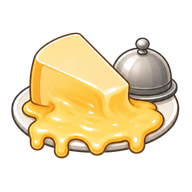

<div align="center">



# MacRaclette

**Your Mac is hot enough. Time to melt some cheese.**

A native macOS menu bar app that monitors your CPU, GPU and battery temperatures in real time — and tells you when your Mac is ready to serve raclette. 🧀

[](https://github.com/MagnusDot/MacRaclette/releases)
[](https://swift.org)
[](https://github.com/MagnusDot/MacRaclette/releases/latest)
[](LICENSE)

<br/>


</div>

---

## What it does

MacRaclette sits quietly in your menu bar, watching your Mac's temperature sensors. Set a threshold, and when your machine crosses it — the icon melts into cheese and raclette mode activates.

Beyond the joke, it's a genuinely useful thermal monitor: live heat source breakdown by component, fan RPM, session stats, and a trend indicator so you know if things are heating up or cooling down.

<div align="center">

| Cool | Melting | Ready 🧀 |
|:---:|:---:|:---:|
|  |  |  |
| Below threshold | Getting there | Raclette time |

</div>

---

## Features

- 🌡️ **Live sensor readings** — Apple HID + SMC, works on Apple Silicon and Intel
- 🔥 **Heat source breakdown** — CPU, GPU, battery, memory, storage with animated bars
- 💨 **Fan monitoring** — real-time RPM and load percentage
- 📊 **Session stats** — min / avg / max temperature and thermal pressure
- 📈 **Trend indicator** — Rising, Stable, or Falling at a glance
- 🎛️ **Adjustable threshold** — set your own raclette temperature
- 🍎 **Truly native** — SwiftUI, no Dock icon, no telemetry, no network

---

## Installation

1. Download `MacRaclette.dmg` from the [latest release](https://github.com/MagnusDot/MacRaclette/releases/latest)
2. Open the DMG and drag **MacRaclette** into your Applications folder
3. First launch: **right-click → Open** (app is not notarized)

> Requires macOS 14 Sonoma or later.

---

## Build from source

```bash
git clone https://github.com/MagnusDot/MacRaclette.git
cd MacRaclette
make build
```

Or open `MacRaclette.xcodeproj` in Xcode and run the `MacRaclette` scheme.

---

<div align="center">

*Made with SwiftUI · No App Store · No tracking*

</div>
